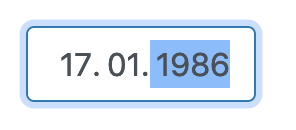

# NgxDateInput

Date Input Component, focused on Keyboard Input, Bootstrap Style, intended to use in an angular project.

This is attempting to recreate firefox or chrome native date pickers.

Can be used with either Reactive or Template driven Forms.

## Usage

Navigation with Left/Right Arrow Keys possible, also with Tabs.
Dot Key will also jump to the next input.
Backspace/Delete/Clear resets the whole focused input.
Up/Down Arrow increases/decreases number by one.
Pasting into any input using the pattern dd.mm.yyyy, dd/mm/yyyy or dd-mm-yyyy works.
All other keys are disabled.

Range of day is set to 1 to 31
Range of month is set to 1 to 12
Range of year is set to 1900 to 2100

There's also autocomplete for day:
if the first number is 4 or higher, a '0' is automatically added in front of it and the focus is shifted to month.
and autocomplete for month:
if the first number is 2 or higher, a '0' is automatically added in front of it and the focus is shifted to year. 

## Api

placeholder: string
type: 'DEFAULT' | 'BIRTHDAY'

type birthday additionally restricts year values to the range 1939 to 2019 (80 years up to this current year).
it also adds autocomplete to year, when two numbers are entered (except 19 or 20):
a number smaller than 19 gets autocompleted to 20 + xx, a number greater than 20 gets autocompleted to 19 + xx.

## Angular cli details

This library was generated with [Angular CLI](https://github.com/angular/angular-cli) version 7.2.0.

## Code scaffolding

Run `ng generate component component-name --project ngx-date-input` to generate a new component. You can also use `ng generate directive|pipe|service|class|guard|interface|enum|module --project ngx-date-input`.
> Note: Don't forget to add `--project ngx-date-input` or else it will be added to the default project in your `angular.json` file. 

## Build

Run `ng build ngx-date-input` to build the project. The build artifacts will be stored in the `dist/` directory.

## Publishing

After building your library with `ng build ngx-date-input`, go to the dist folder `cd dist/ngx-date-input` and run `npm publish`.

## Running unit tests

Run `ng test ngx-date-input` to execute the unit tests via [Karma](https://karma-runner.github.io).

## Further help

To get more help on the Angular CLI use `ng help` or go check out the [Angular CLI README](https://github.com/angular/angular-cli/blob/master/README.md).
